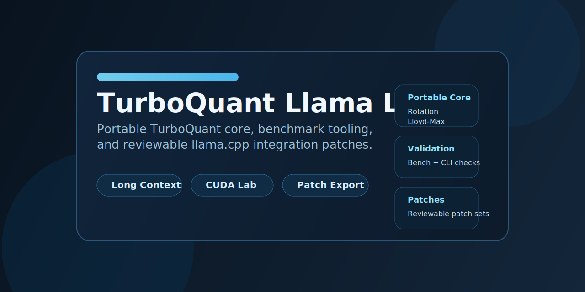

<p align="center">
  
</p>

# TurboQuant Llama Lab

[](LICENSE)


Experimental TurboQuant implementation and integration path for a `llama.cpp`-style runtime.

This repository is designed to help builders who want:

- a portable TurboQuant core
- practical benchmark tooling
- reviewable `llama.cpp` integration patches
- honest guidance about speed, memory, and validation status

## Why This Repo Exists

TurboQuant is exciting, but most users still need a practical path from paper ideas to
runtime experiments.

This repo tries to make that path useful:

- a portable C++ core you can build quickly
- extracted `llama.cpp` patch sets you can inspect and discuss
- validation scripts for baseline vs TurboQuant runs
- explicit usage profiles instead of one-size-fits-all claims

## At A Glance

| Area | What You Get |
| --- | --- |
| Portable core | Rotation, quantization, and TurboQuant building blocks in standalone C++ |
| Runtime path | Reviewable `llama.cpp`-style integration patches |
| Validation | CLI-based baseline vs TurboQuant comparison script |
| Docs | Architecture, profiles, validated model notes, and roadmap |

## Best Use Cases

- studying TurboQuant-style long-context tradeoffs
- experimenting with KV compression in a `llama.cpp` ecosystem
- benchmarking speed-first vs memory-first profiles on local hardware
- extracting reusable algorithm pieces for other backends

## Purpose

This project is the publishable home for the V6 Alpha TurboQuant work:

- exact TurboQuant algorithm experiments
- fused CUDA attention-path experiments
- packed KV-cache storage experiments
- long-context benchmarking on local GPUs

## Positioning

This is a lab implementation and research bridge.

It is:

- not the original Google release
- not a claim of paper-perfect production parity
- a practical open implementation path for TurboQuant ideas in a `llama.cpp` ecosystem

It aims to be useful for users who want to:

- study the algorithm
- build the portable pieces quickly
- evaluate long-context tradeoffs on their own hardware
- apply and iterate on the runtime integration as patch sets

## Public Highlights

- portable core in [`cpp/`](cpp/)
- benchmark tool in [`cpp/tools`](cpp/tools)
- validator in [`scripts/validate_llama_cli.py`](scripts/validate_llama_cli.py)
- extracted patch sets in [`patches/llama.cpp/generated`](patches/llama.cpp/generated)
- benchmark summary in [`docs/BENCHMARK_HIGHLIGHTS.md`](docs/BENCHMARK_HIGHLIGHTS.md)

## Model Support Status

### Portable Core

The standalone TurboQuant core is model-agnostic.

It operates on:

- vector dimension
- bit budget
- QJL projection size
- optional outlier-channel settings

So the core itself is not tied to `Qwen3.5-9B`.

### Validated Runtime Focus

The current runtime-oriented work has been validated mainly against:

- `Qwen3.5-9B-Q8_0.gguf`
- `Qwen3.5-27B-Q3_K_M.gguf`

That means:

- the algorithm is generic
- the current `llama.cpp` integration and rollout tuning are still Qwen-focused

### What This Means

Other transformer-family models should be possible, but they may need:

- different layer rollout
- different bit/QJL tuning
- fresh validation
- model-specific long-context benchmarking

## Current Public Scope

The current public scope includes:

1. a portable TurboQuant C++ core
2. a standalone benchmark tool
3. a validation script for `llama.cpp` runs
4. extracted `llama.cpp` patch sets
5. architecture, quickstart, usage-profile, benchmark-highlight, validated-model, and roadmap documentation

## Repository Layout

- `cpp/`
  Portable TurboQuant C++ core and standalone tools.
- `scripts/`
  Validation and patch-export tooling.
- `docs/`
  Architecture, publishing notes, quickstart, and usage guidance.
- `patches/llama.cpp/`
  Home for extracted `llama.cpp` integration patch sets.
- `benchmarks/`
  Benchmark notes and future published reports.
- `assets/`
  Visual assets for the GitHub landing page and future publishing material.

## License

This repository is licensed under Apache-2.0.

See [LICENSE](LICENSE).

## Community

- contribution guide: [CONTRIBUTING.md](CONTRIBUTING.md)
- code of conduct: [CODE_OF_CONDUCT.md](CODE_OF_CONDUCT.md)
- support policy: [SUPPORT.md](SUPPORT.md)
- security policy: [SECURITY.md](SECURITY.md)
- roadmap: [docs/ROADMAP.md](docs/ROADMAP.md)
- benchmark highlights: [docs/BENCHMARK_HIGHLIGHTS.md](docs/BENCHMARK_HIGHLIGHTS.md)

## Quick Start

Build the standalone benchmark:

```bash
cmake -S . -B build
cmake --build build -j
./build/turboquant-bench --dim 128 --bits 4 --qjl-dim 128 --samples 32 --queries 8
```

Validate a `llama.cpp` binary against baseline and TurboQuant profiles:

```bash
python3 scripts/validate_llama_cli.py compare \
  --bin /path/to/llama-cli \
  --model /path/to/model.gguf \
  --output-dir /tmp/turboquant-compare
```

Export the current lab integration into reviewable patch files:

```bash
scripts/export_llama_cpp_patches.sh
```

The generated patch sets are written under:

- `patches/llama.cpp/generated/`

For a guided start, read:

1. [docs/QUICKSTART.md](docs/QUICKSTART.md)
2. [docs/USAGE_PROFILES.md](docs/USAGE_PROFILES.md)
3. [docs/VALIDATED_MODELS.md](docs/VALIDATED_MODELS.md)
4. [docs/BENCHMARK_HIGHLIGHTS.md](docs/BENCHMARK_HIGHLIGHTS.md)

## Current Status

### Ready Now

- portable algorithm core
- standalone benchmark executable
- validation tooling
- generated `llama.cpp` patch sets
- documentation for profiles and validated models

### Still Experimental

- full runtime behavior across all model families
- universal speed wins
- production-grade stability across every rollout shape

## Non-Goals

This repository does not claim:

- official affiliation with Google
- official TurboQuant reference status
- guaranteed paper-level benchmark parity on every backend
- one universal best profile for all workloads
